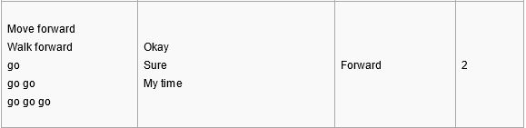
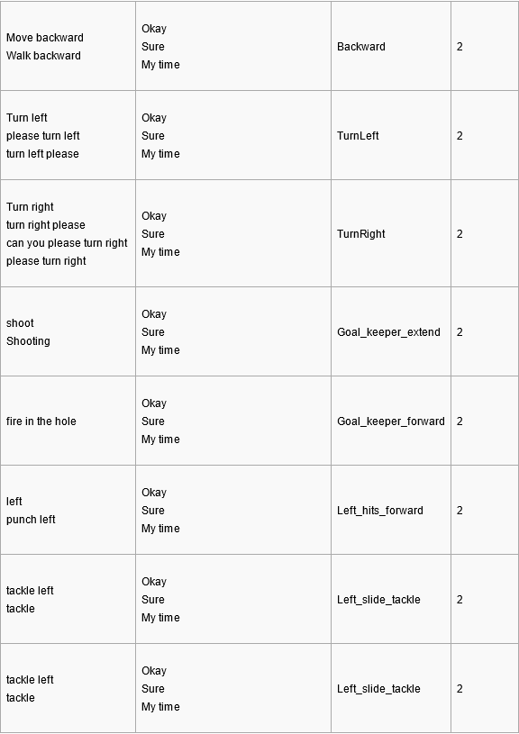
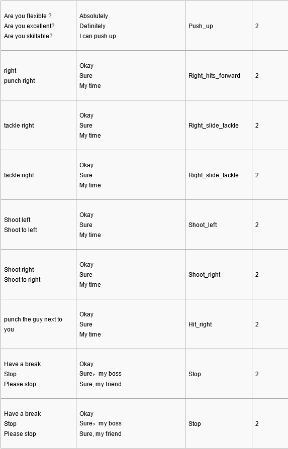
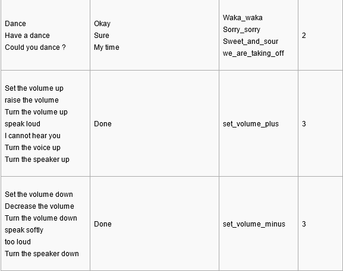

Alexa demo for Yanshee robot

See [alexa-avs-sample-app](https://github.com/alexa/alexa-avs-sample-app/wiki/Raspberry-Pi)

1> build alexa java client and ZLK38AVS 
-----------------------
### Step 1 Stop the default voice recognition application
It is not a good choice to run more than one voice recognition application on one device, so please disable the default voice recognition before porting Alexa to Yanshee.
* Update the config file.

The default voice recognition is iFlytek. If the users are going to make Alexa working on Yanshee, they need to stop the default voice recognition application.
Please make sure that all the config file robotmgmt.conf are the same as below for “robotvoice_cn” and “robotvoice_en”, which located in “cat /mnt/1xrobot/usr/robotmgmt/robotmgmt.conf”. 
```shell
pi@Yan_1EFE:~ $ cat /mnt/1xrobot/usr/robotmgmt/robotmgmt.conf   
#robotagent  
autorestart 1  
watchdogdisable 0  
adminenable 1  
#robotvoice_cn  
autorestart 0  
watchdogdisable 1  
adminenable 0  
#robotvoice_en  
autorestart 0  
watchdogdisable 1  
adminenable 0  
```
* Restart the service

Please execute the below command, the default voice recognition application should be stopped.
```shell
sudo service ubtedu restart
```

### Step 2 Get alexa-avs-sample
```shell
git clone https://github.com/RobotAlexa/alexa_java_client.git
cd alexa_java_client
./automated_install.sh
```
Need create alexa product. Please follow the steps by [alexa-avs-sample-app wiki](https://github.com/alexa/alexa-avs-sample-app/wiki/Raspberry-Pi).


### Step 3 Get Microsemi ZL38050 driver
Please get the ZL38050 driver code from github.
```shell
git clone https://github.com/Microsemi/ZLK38AVS.git
```
But please note, Yanshee use Microsemi ZL38050 for echo cancellation, the users may need to build the drivers if the kernel have upgraded the Raspbian. If there are some recording problems, please follow below steps to fix it.

Steps :
1.	ZL38050 is controlled by raspberry pi via I2C. But default configuration of the driver is using SPI to update the configurations for ZL38050. 
```shell
pi@Yan_1EFE:~/ZLK38AVS $ ls  
apps  config.mk  docs  LICENSE.txt  Makefile  README.md  vproc_sdk  
```
2.	Update config.mk to configure the driver using I2C.
```shell
pi@Yan_1EFE:~/ZLK38AVS $ git diff config.mk  
diff --git a/config.mk b/config.mk  
index 534ff41..72efeb5 100644  
--- a/config.mk  
+++ b/config.mk  
@@ -16,6 +16,7 @@ export MSCC_LOCAL_LIB_PATH =$(ROOTDIR)/libs  
 export platformUser :=`id -un`  
 export platformGroup :=`id -gn`  
   
+export HBI=I2C  
 AMAZON_AVS_ONLINE_REPOSITORY =https://github.com/alexa/avs-device-sdk  
 SENSORY_ALEXA_ONLINE_REPOSITORY =https://github.com/Sensory/alexa-rpi  
 AMAZON_AVS_LOCAL_DIR ?=$(ROOTDIR)/../amazon_avs_cpp  
pi@Yan_1EFE:~/ZLK38AVS $  

```
3.	If there are some problems of installing the drivers. It is possible that the kernel version is not matched. Please get the special version which we already verified.
 
 **Check the kernel version:**
```shell
pi@Yan_EE76:~ $ uname -a
Linux Yan_EE76 4.9.59-v7+ #3 SMP Sat Jun 16 13:54:26 HKT 2018 armv7l GNU/Linux
```
 **Get the 4.9.59-v7+ version kernel**
```shell
git clone https://github.com/raspberrypi/linux.git -b rpi-4.9.y-rebase
```
4. After downloading the rpi-4.9.y-rebase source code. Please use below commands to compile the kernel and install it to Yanshee
```shell
cd linux
KERNEL=kernel7
make bcm2709_defconfig
make -j4 zImage modules dtbs
sudo make modules_install
sudo cp arch/arm/boot/dts/*.dtb /boot/
sudo cp arch/arm/boot/dts/overlays/*.dtb* /boot/overlays/
sudo cp arch/arm/boot/dts/overlays/README /boot/overlays/
sudo cp arch/arm/boot/zImage /boot/$KERNEL.img
```
5.	When the new linux kernel is installed to Yanshee, please restart Yanshee. And use “uname -a” to check the version if it is 4.9.59-v7+.
6. Go back to ZL38050 source code directory and compile the ZL38050 source code
```shell
cd ZLK38AVS/
make host 
```
7. After compiling the source, the drivers will be installed automatically. After Yanshee reboot, please check hbi.ko, snd_soc_zl380xx.ko and snd_soc_microsemi_dac.ko are installed.
```shell
pi@Yan_EE76:~ $ lsmod
Module                  Size  Used by
fuse                   99353  3
cmac                    3111  1
bnep                   12089  2
hci_uart               19944  1
btbcm                   7992  1 hci_uart
rfcomm                 37762  11
bluetooth             367361  32 hci_uart,bnep,btbcm,rfcomm
brcmfmac              293226  0
brcmutil                9927  1 brcmfmac
cfg80211              545662  1 brcmfmac
rfkill                 21008  6 bluetooth,cfg80211
spi_bcm2835             7608  0
i2c_bcm2835             7231  1
snd_soc_bcm2835_i2s     7378  2
bcm2835_gpiomem         3900  0
fixed                   3285  0
uio_pdrv_genirq         3923  0
uio                    10396  1 uio_pdrv_genirq
evdev                  12359  6
joydev                  9988  0
snd_soc_microsemi_dac     3274  0
snd_soc_zl380xx         3070  1
snd_soc_core          180292  3 snd_soc_zl380xx,snd_soc_bcm2835_i2s,snd_soc_microsemi_dac
snd_compress           10242  1 snd_soc_core
snd_pcm_dmaengine       5958  1 snd_soc_core
snd_pcm                98333  4 snd_pcm_dmaengine,snd_soc_bcm2835_i2s,snd_soc_microsemi_dac,snd_soc_core
snd_timer              24111  1 snd_pcm
snd                    70454  6 snd_compress,snd_timer,snd_soc_core,snd_pcm
hbi                    70331  0
i2c_dev                 7041  2
ip_tables              13142  0
x_tables               20590  1 ip_tables
ipv6                  408387  30
```

### Step 4 Check if the audio can work
Before checking the audio functions, please install “sox” by “sudo apt install sox”. Please record a wav file, and replay it to check if the Mic and Speaker can work
```shell
sudo apt install sox
```
Record the audio:
```shell
rec -t wav test.wav
```
Check if the wav file is right:
```shell
play test.wav
```

2> control robot 
--------------------
* project: samples/javaclient
Support: action, dancing, moving, setup volume, and stop
* see: com.amazon.alexa.avs.robot.communicate.MsgSendManager

3> YansheeControl
----------------------
* project: samples/YansheeControl

This version uses the YansheeSDK to control robot. YansheeControl is socket server, and javaclient is socket client.
javaclient via YansheeControl to control robot.

4> Support utterances
----------------------
* Inner actions path: /mnt/1xrobot/res/hts/ 




